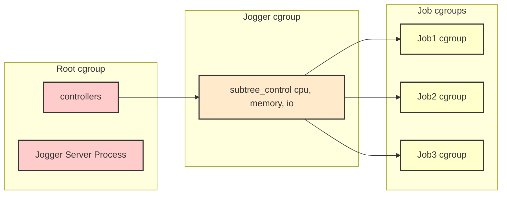

--- 
authors: Dustin Currie (dustinevancurrie@gmail.com)
state: draft
---

> **_Note:_** This is a project I recently wrote for an interview. It is not complete, and currently only runs in linux due to its use of cgroups. 


# RFD 1: Job Runner Service

## What

Jogger is a system that allows users to run jobs on remote servers. It includes a CLI where users can start, stop, check the status of, and examine the output of jobs run remotely. Commands from the CLI connect to a remote host where the Jogger Server is present, which then manages job processes accordingly.

## Details

### CLI
`jog`

#### Example Usage
```bash
# Note the use of the divider -- between jog cli inputs and the job command and args. 
jog start [-D --host address[:port]] -- [command [argument ...]]
jog [stop | status | output] [-D --host address[:port]] [job_id] 
jog [-h | --help]

# You must set the following to securely connect to the host:
export JOGGER_CA_CERT_FILE=<path-to-ca-cert>
export JOGGER_USER_CERT_FILE=<path-to-user-cert>
export JOGGER_USER_KEY_FILE=<path-to-user-private-key>

The options are as follows:
  -D --host       address[:port] full details: https://github.com/grpc/grpc/blob/master/doc/naming.md
  -h --help       print this usage information

The commands are as follows:
  start           start a job
  stop            stop a job
  status          get the status of a job
  output          stream the output of a job
 
 
# Examples: 
# Starting a job
$ jog start --host=localhost:7654 -- echo 'echo the job'
> started: uuid1

# Setting the JOGGER_HOST environment variable means you don't need to use the --host flag every time
export JOGGER_HOST=localhost:7654

$ jog start -- echo 'run another one'
> started: uuid2

$ jog stop uuid2
> uuid2 already exited with status: completed

$ jog start -- long-running-job arg1 arg2 arg3
> started: uuid3

$ jog status uuid3
> status: running

$ jog output uuid1
> log lines starting from the beginning and steaming until 
this command is terminated or the job moves to a done state.
```

#### UX
Our users have likely run jobs on remote servers via ssh. The Jogger CLI is different in a key way--it's not interactive. To make the CLI more familiar to these users, the goal is to reduce the CLI's footprint so that users can focus on the commands/jobs they run. The following design decisions stem from this thinking:

#### Jobs are Slices of Strings.
When starting a job, the `jog` CLI slices `os.Args` to remove itself and its own arguments, `--` is used as a divider for clarity.

The remaining `[]string` defines the job, where `arg[0]` is the command/binary to run on the server, and `arg[1:]` represents arguments to that command. This strategy avoids repeated flags for arguments and the environment. However, a downside to this approach is that server-side shell substitution requires careful escaping and the use of `bash -c`.

#### Use Environment Variables For Connection Information
The CLI supports the following environment variables (client side). These will also be prominently displayed in the USAGE info
```bash
export JOGGER_HOST=<host:port>
export JOGGER_CA_CERT_FILE=<path-to-ca-cert>
export JOGGER_USER_CERT_FILE=<path-to-user-cert>
export JOGGER_USER_KEY_FILE=<path-to-user-private-key>
```

#### Note on CLI Security Configuration
Each use of `jog` creates a new connection with mTLS. For this to work, the user private key file and certificate files should be listed in the environment variables above. See: [Security](#security)

### GRPC
GRPC is used for communication between Client and Server. The CLI subcommands described above map to RPC calls to a Jogger Server. See: [job_service.proto](https://github.com/dustinevan/jogger/blob/develop/pkg/proto/job_service.proto)

[`buf`](https://buf.build/) is being used to generate the client, server stubs, and related protobuf code. The Makefile includes `make grpc` for this purpose.

### Security
Client and Server communicate over a connection with [mTLS](https://en.wikipedia.org/wiki/Mutual_authentication#mTLS). Jogger is configured to use [X.509 certificates](https://www.rfc-editor.org/rfc/rfc5280) that have been manually generated using `make gen-certs` For this project, we assume that some future outside service will be responsible for generating and distributing the necessary certificates and keys.

#### Notes on Keys and Certificates
For TLS keys, this project uses the ECDSA algorithm with the P256 curve. Keys are generated for the CA, the Jogger Server, and the User who has access to the CLI.

```Go
privateKey, err := ecdsa.GenerateKey(elliptic.P256(), rand.Reader)
```
Three certificates are then generated:
1. _Self-Signed CA Certificate_: This certificate is used by both the Client and the Server to verify the identity of the other party.
2. _Server Certificate_: The Jogger Service uses this certificate to prove its identity to the CLI.
3. _User Certificate_: The User Certificate has the username in the Common Name (CN)) field found here: `Userx509Certificate.Subject.CommonName` see: [Access Control](#access-control)

The file locations of these certificates are then added to the user or server environment vars, and read when a connection with mTLS is made.

#### TLS Cipher Suites
TLS will be configured to support the `TLS_ECDHE_ECDSA_WITH_AES_128_GCM_SHA256` cipher suite, which is the [first preference](https://go.dev/src/crypto/tls/cipher_suites.go) in the go documentation. This suite only supports TLS 1.2 and contains our chosen algorithm.

### Access Control
Internally, the Jogger Server ensures that each user only has access to their jobs. To do this, usernames are included in Common Name field found in User Certificates. It is assumed that an external auth system will add these usernames to certs, and ensure usernames are unique. Currently, `make gen-certs` sets the Common Name to `$USER` in the generated User Certificate. If needed this can be modified like so `make USER=lucy gen-certs` To create multiple users the underlying gen-certs code should be edited.

When a request is made, the User Certificate can be retrieved from the context using
```go
import "google.golang.org/grpc/peer"
...
p, ok := peer.FromContext(ctx)
```
The username then becomes a parameter in calls to the internal job manager

### Server
The Jogger Server is present on a host where Jobs are run. It implements a GRPC service that accepts requests from the CLI, checks authorization by extracting the username from the User Certificate, and hands off work to the Job Manager API.

#### System Requirements
- The server makes use of Linux cgroup-v2. It is recommended that it be run on a host with a [Linux distribution](https://github.com/opencontainers/runc/blob/main/docs/cgroup-v2.md) that enables and uses cgroup-v2 by default]
- The server must be run with root permissions to manage cgroupfs.

#### Server mTLS Environment Variables
The following environment variables are required for the server to securely connect to the client, and must be set before starting the server.
```bash
export JOGGER_CA_CERT_FILE=<path-to-ca-cert>
export JOGGER_SERVER_CERT_FILE=<path-to-user-cert>
export JOGGER_SERVER_KEY=<path-to-user-private-key>
```

### Job Manager
The JobManager is an internal service that manages the lifecycle of jobs. It holds a map of Job by job_id:username. Calls to it's exported API methods, `Start`, `Stop`, `Status`, and `Output`, search for the job by username and `job_id` and call associated methods on that Job. Job instances are wrappers around `exec.Cmd` that include extra functionality for output streaming, cancellation, status, and `cgroup-v2` management.

#### Starting a Job
When the client asks to start a job, first the server creates a new job instance. During construction:
- The job is assigned a uuid
- A child context of the server context is created with a cancel function. This context is passed to the `exec.Cmd` instance, and the cancel is held by the job for later use.
- the `exec.Cmd` is created and composed with an `OutputStreamer`, a `Cancel` function that sends `SIGTERM`, and its `WaitDelay` is set.
- cgroups-v2 setup and teardown functions are created

When construction is complete, the `Start` method is called on a job. This method starts a goroutine that does the following:
- Sets the job status to Running
- Calls `Start` on the `exec.Cmd`
- Calls the `cgroups-v2` `Setup` function -- which [creates a new cgroup](#cgroups-v2) for the job
- Defers the `cgroups-v2` `Teardown` function -- which [removes the cgroup](#cgroups-v2) when the job is done
- Defers setting the status to completed if the status is still in running state
- Waits for the cmd to finish

> **_Note:_** _This goroutine does not watch for a context cancellation. Internally, the `exec.Cmd` instance watches for a context cancellation and will call the job's cancel function accordingly._

#### Output Streaming
Output stream requirements specify that the server should send the entire output of a job to the client when output is requested. For completed jobs, this is straightforward. For running jobs, the server should stream the output as it is produced. To do this for multiple clients, we need to collect `STDOUT` and `STDERR` pipes and then make the data available to multiple clients streams.

This functionality is encapsulated in the `OutputStreamer` struct.
```go
type OutputStreamer struct {
    // stdout and stderr are combined and written into the output byte slice 
    output []byte
    writerClosed atomic.Bool
}
...
// OutputStreamer is an io.Writer and the jobs `exec.Cmd` Stdout and Stderr are set to this instance
func (o *OutputStreamer) Write(p []byte) (n int, err error) {
    // Write to o.output  
}
func (o *OutputStreamer) NewStream(ctx context.Context) <-chan []byte {
    // create a new channel and start a looping goroutine that writes to it, keeps track of the index, and uses a ticker to check for new data, writing to the channel if found. 
}

func (o *OutputStreamer) CloseWriter() {
    // close the channel and set the output to nil
}
...
```
#### Stream Closure and Cancellation
The OutputStreamer handles closure and cancellation in the following ways:
- When a client closes the stream context, the streaming goroutine closes the channel and exits. Note that this is the only case where the stream ends while the job process is still running.
- When a job is stopped, completes, fails or is killed, the streaming goroutine finishes sending all the data, closes the channel and exits.
- When the server is shut down, its context is cancelled, the context of all exec.Cmd instances are children of this context. exec.Cmd intances each call the cancel functions given them, and streams are canceled as in #2


#### Stopping a Job
When the `Stop` method called on a job, the status is set and the internal context cancellation function is called. Jogger is designed to cascade this cancellation through all underlying goroutines.

> **_Note:_** _The `exec.Cmd` struct and API internally provide most of the functionality needed for cancellation and output streaming. Jogger is designed around preferring this functionality, and wrapping it with what's needed to support our output streaming and `cgroup-v2` requirements. In the diagram below, the internals of `exec.Cmd` are not shown._

To get a full view of this flow, the diagram below models a user with two shells open
- Window1: The output stream of running job `job-uuid1`.
- Window2: The user executes `jog stop job-uuid1`

We skip the CLI, Jogger Server, and Job Manager in this diagram to focus on the internals of the Job, exec.Cmd, and OutputStreamer.

1. The `job.Stop()` method is called by the Job Manager
2. the cancel function held internally by the job is called -- this cancels the context used by internal exec.Cmd
3. `exec.Cmd` calls the cancel function created when it was started. This sends a `SIGTERM` to the process
4. Meanwhile, the OutputStreamer is still streaming output data to the client
5. The underlying process represented by `exec.Cmd` exits normally or is killed based on the WaitDelay.
6. The error output of `cmd.Wait()` is used to determine the final status of the job
7. The goroutine waiting for the process to finish defer closes the OutputStreamer and exits.
8. OutputStreamer finishes sending all data to the client and closes the channel used for streaming
9. The client receives the last of the output and the command prompt is returned

#### Getting the Status
- Look up the job by username and id, then return the status

### cgroups-v2
The Jogger Server uses [cgroups](https://man7.org/linux/man-pages/man7/cgroups.7.html) to manage CPU, memory, and IO resources for jobs. The jogger server itself, runs in the root cgroup, but creates a separate cgroup for each job. The controllers made available to job cgroups are limited to, CPU, IO, and Memory, by creating an intermediate group `/sys/fs/cgroup/jogger` and writing `cpu`, `memory`, and `io` to its `cgroup.subtree_control` file (this also must be done to the root `cgroup.subtree_control` as well). Job cgroups are children of `/sys/fs/cgroup/jogger` group.

```bash
# Example of setting up the jogger cgroup
echo "+cpu +memory +io" > /sys/fs/cgroup/cgroup.subtree_control
mkdir /sys/fs/cgroup/jogger
echo "+cpu +memory +io" > /sys/fs/cgroup/jogger/cgroup.subtree_control
```



#### Starting a Job in a cgroup
When a job is sent to the server, the server creates a new cgroup for the job[^1] using the `job_id` as the directory name. Then, when the job is created, the exec.Cmd is configured with the file descriptor of the new cgroup. This feature makes use of the [clone3 syscall](https://man7.org/linux/man-pages/man2/clone.2.html) with the `CLONE_INTO_GROUP` flag. The result is that, even though the server is running in the root cgroup, it can start a new process in the job cgroup.

#### Cleaning Up cgroups
Jogger cleans up empty cgroups by waiting for the job to finish and polling the `cgroup.events` file for `populated 0`. When this is detected, the server removes the cgroup directory.

#### CPU Management
By default each cgroup has a cpu.weight file with a value of 100. When distributing cpu time, all child cgroup cpu weights are summed and divided by the number of processes. The implementation uses these defaults. In the future, Jogger may need to implement a strategy to limit the cost of context switching when many jobs are running at once.

#### Memory Management
For this implementation, Jogger is configured with a memory target, and jobs are set with `memory.high` as 20% of that target (in bytes). In a future implementation, an algorithm could be produced that dynamically writes `memory.high` values in cgroups that reflect how many jobs run on the server, and the standard deviation of memory needs.

From the docs:
> "memory.high" is the main mechanism to control memory usage.
Over-committing on high limit (sum of high limits > available memory)
and letting global memory pressure to distribute memory according to
usage is a viable strategy. Because breach of the high limit doesn't trigger the OOM killer but
throttles the offending cgroup, a management agent has ample
opportunities to monitor and take appropriate actions such as granting
more memory or terminating the workload.

#### IO Management
As with CPU, IO uses a weight based strategy by default. For this implementation, Jogger will not change these defaults.

#### cgroup.FSManager
This implementation doesn't require any dynamic management of cgroups. Everything needed can be written before a job starts, and can be removed after a job ends.

Because managing cgroups involves creating, deleting, writing, and reading files, a new package `cgroup` with a struct `FSManager` is created to encapsulate this logic. The `Setup` and `Teardown` functions described earlier are calls to FSManager's `AddGroup`, and `RemoveGroup` methods.

#### Testing That cgroups are working
To test that limits are being respected, we can use three programs.
1. CPU: Generating password hashes with bcrypt -- `bcrypt.GenerateFromPassword([]byte(password), bcrypt.MaxCost)`
2. Memory: Calling a function in a loop that uses `string.Split()` on a long string to find the number of spaces. This kind of program doesn't need much memory to function, but it allocates and creates a lot of garbage to clean up. Memory limits will throttle the program rather than the OOM killer stopping it.
3. I/O: Read and write to a file in a loop.

For each program, we create 10 jobs that run concurrently for 10 seconds. When jobs stop, they should output the number of loops performed. By comparing the outputs over, say, 10 runs, we can test whether the cumulative loops for each job trend toward 1/10th of the cumulative total. A job that starts, stops and reads the output of `systemd-cgtop` could be used to adjust these numbers.


> **_Note:_** _In this implementation, the Jogger server is run as root. In the future, [delegation](https://man7.org/linux/man-pages/man7/cgroups.7.html) could be used to allow the server to run as a non-root user._


[^1]: For this implementation, the server creates a new cgroup for each job, in the future a pool of cgroups could be used to avoid the overhead of creating and removing cgroups for each job.

[docs](https://git.kernel.org/pub/scm/linux/kernel/git/stable/linux.git/tree/Documentation/admin-guide/cgroup-v2.rst?h=v5.15.163)

# jogger

A simple remote job runner.

### Quickstart Guide -- Local Development and Testing

Currently, Jogger should be built from source. A `Makefile` is provided to simplify setup. 

```bash
# 1. Clone the repository:
git clone git@github.com:dustinevan/jogger.git

# 2.Change to the repository directory:
cd jogger

# 3. Jogger uses gRPC over mTLS to communicate between client and server. 
# Generate the keys and certificates for local development:
make gen-certs

# 4. gen-certs prints the environment export commands needed to run the
# server and client. These environment variables point to the keys and
# certificates needed for mTLS. Run the exports:
...

# 5. Install the client binary: `jog`, and check that it is in the PATH:
make install-cli
which jog

# 6. Run the server -- note that currently the server must run on localhost:50051
# as this address is encoded in the server's certificate:
make run-server

# 7. Start your first job:
jog run -- echo "Hello, World!"

# 8. Checkout what jog can do:
jog --help
```
